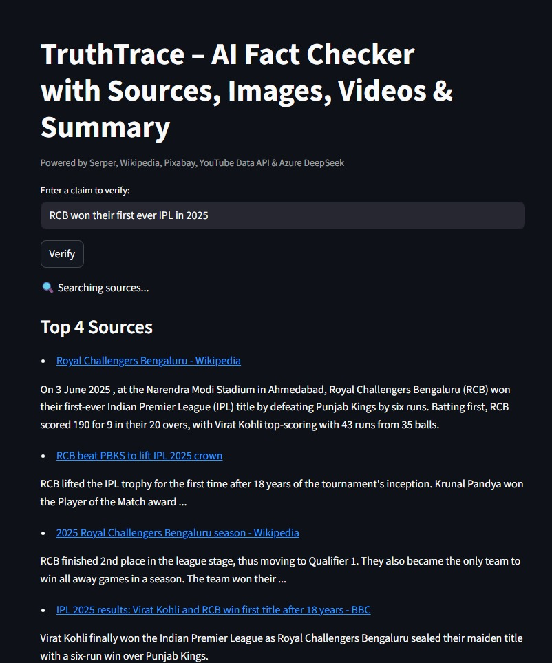
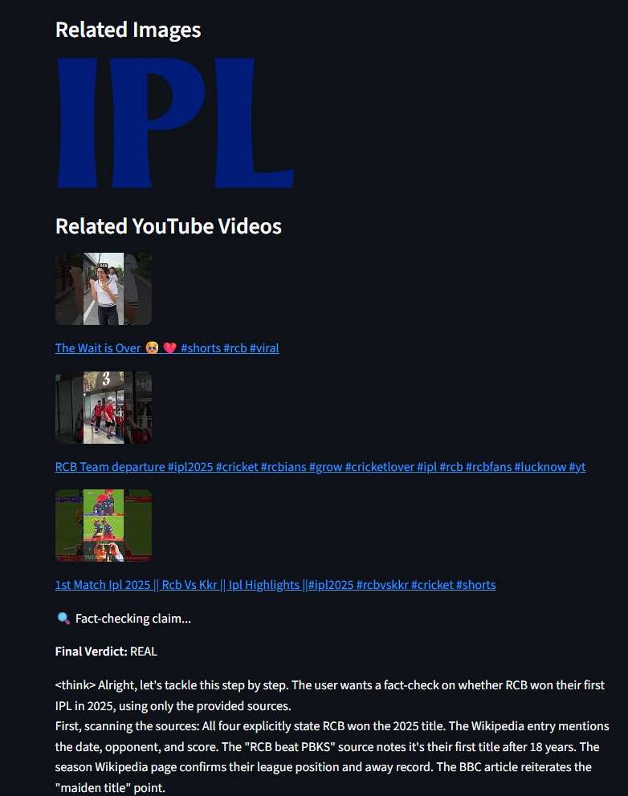
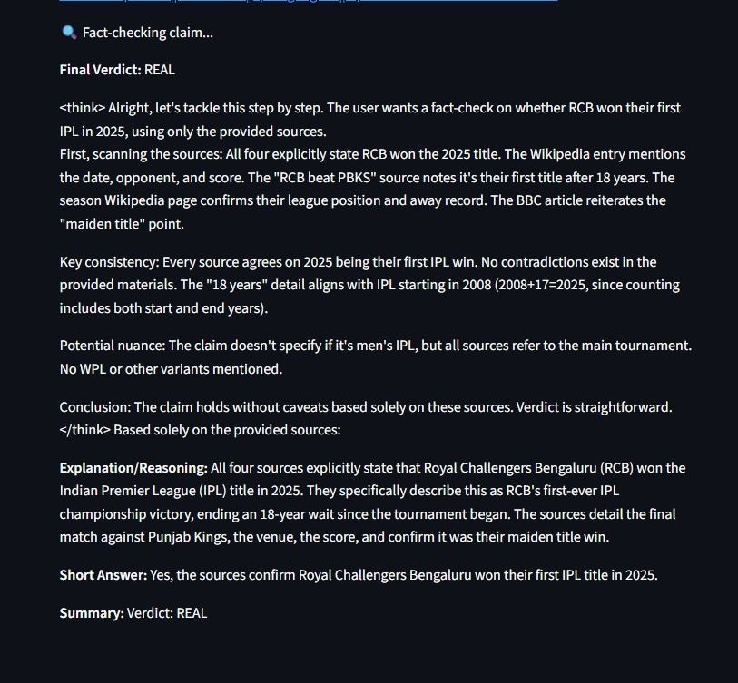

# 🧠 TruthTrace-LLM: End-to-End Automated Claim Verification & Evidence Retrieval

**TruthTrace-LLM** is an integrated **AI-powered platform** for **rigorous, real-time claim verification** and **contextual evidence retrieval**.  
It combines intelligent information retrieval, structured knowledge bases, multimedia enrichment, and large language model reasoning to deliver **transparent verdicts** for any natural language claim.

---

## 🔹 Key Features

### ✨ Intelligent Claim Preprocessing  
- Extracts important keywords & context from user queries for **targeted search** and analysis.

### 🌐 Multi-Modal Evidence Acquisition  
- **Serper API** – Real-time, high-authority web search  
- **Wikipedia API** – Structured factual data and infobox images  
- **Pixabay API** – Relevant contextual imagery  
- **YouTube Data API** – Multimedia/video references

### 📦 Evidence Aggregation & Filtering  
- Ensures **diversity**, **credibility**, and **contextual relevance** of all retrieved sources.

### 🤖 Evidence-Constrained LLM Reasoning  
- Uses **DeepSeek LLM** (Azure-hosted) to verify claims **strictly based on retrieved evidence**.  
- Output Verdicts:  
  - ✅ `REAL`  
  - ❌ `FAKE`  
  - ⚠️ `MISLEADING`

### 🖼 Contextual Multimedia Enrichment  
- Adds **images** and **videos** to verdicts for enhanced clarity.

### 🔁 Fully Autonomous Pipeline  
- From **claim input → evidence retrieval → verdict generation** with minimal manual steps.

---

## 🏗️ System Architecture

**Flow:**  
`[User Input] → [Streamlit UI] → [Evidence Collection APIs] → [LLM Analysis] → [Verdict + Media Presentation]`

1. **User Interface Layer** – Streamlit-based UI  
2. **Data Acquisition Layer** – Real-time APIs for search, knowledge, and media  
3. **Processing Layer** – Evidence-constrained LLM reasoning  
4. **Presentation Layer** – Verdict + Sources + Images + Videos

---

## 🛠 Tech Stack

| Component        | Technology                                   |
|------------------|----------------------------------------------|
| **Frontend**     | Streamlit                                    |
| **Language**     | Python 3.x                                   |
| **APIs**         | Serper · Wikipedia · Pixabay · YouTube Data API |
| **LLM**          | DeepSeek (Azure-hosted)                      |
| **Env Management**| python-dotenv + `.env`                      |

---

## 📦 Installation

```bash
git clone https://github.com/Srujan4812/TruthTrace-LLM_.git
cd TruthTrace-LLM_
pip install -r requirements.txt
pip install python-dotenv
```

---

### 🔐 Setup Environment Variables

Create a `.env` file in the root directory and add your API keys:  

```env
AZURE_ENDPOINT=...
MODEL_NAME=...
AZURE_API_KEY=...
SERPER_API_KEY=...
PIXABAY_API_KEY=...
YOUTUBE_API_KEY=...
```

⚠️ **Never commit `.env` or API keys to GitHub.**  
Use platform **Secrets Management** when deploying (e.g., Streamlit Cloud).

---

## ▶ Usage (Local)

```bash
streamlit run app.py
```

- Open the generated local URL in your browser.  
- Enter a claim → receive a verdict with **explanation, sources, images, and videos**.

---

## 🌎 Deployment

- **Live App:** [TruthTrace-LLM on Streamlit Cloud](https://truthtrace-llm-aa8ehtudvwvspzlqbqx2kg.streamlit.app/) ✅  
- Can also be deployed on:
  - Azure App Service  
  - Heroku  
  - Any modern cloud platform  
- **Secrets Management** recommended to store keys securely.

---

## 📸 Screenshots

| Claim Entry | Verdict Example 1 | Verdict Example 2 |
|-------------|-------------------|-------------------|
|  |  |  |

---

## 🎥 Demo Video

🎬 **Watch the demo video here:**  
[](assets/demo.mp4.mp4)  
*(Click the image to play the video)*

---

## 📊 Model Performance Metrics

### ✅ Training & Validation
| Metric           | Epoch 1  | Epoch 2  | Epoch 3  |
|------------------|----------|----------|----------|
| Training Loss    | 0.0128   | 0.0024   | 0.0002   |
| Validation Loss  | 0.000476 | 0.000191 | 0.000128 |
| Accuracy         | 1.0000   | 1.0000   | 1.0000   |
| Precision        | 1.0000   | 1.0000   | 1.0000   |
| Recall           | 1.0000   | 1.0000   | 1.0000   |
| F1 Score         | 1.0000   | 1.0000   | 1.0000   |

### 🧪 Test Set Evaluation
| Metric           | Value    |
|------------------|----------|
| Test Loss        | 0.0123   |
| Accuracy         | 0.9983   |
| Precision        | 1.0000   |
| Recall           | 0.9967   |
| F1 Score         | 0.9983   |
| Eval Runtime     | 2.0685 s |
| Samples/Second   | 290.07   |
| Steps/Second     | 9.186    |

**Summary:** Near-perfect precision, recall, and accuracy — ideal for **real-time production fact-checking**.

---

## 💼 Professional Use Cases

- 📰 **Media Fact-Checking** – Speed up editorial verification workflows  
- 🎓 **Academic Research** – Validate claims and citations with evidence  
- 🏢 **Enterprise Knowledge Validation** – Automate compliance checks and internal fact-checking

---

## ⚠️ Disclaimer
This tool provides **automated, evidence-supported verdicts** for informational purposes only.  
It is **not** a replacement for legal, journalistic, or regulatory investigations.

---

**Questions / Contributions:**  
💬 [Open an Issue](https://github.com/Srujan4812/TruthTrace-LLM_/issues) · 📬 Submit a Pull Request
